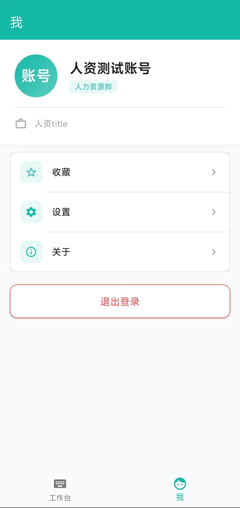
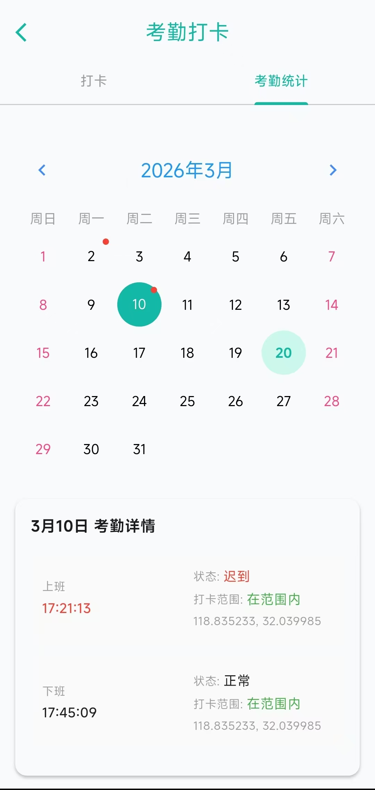
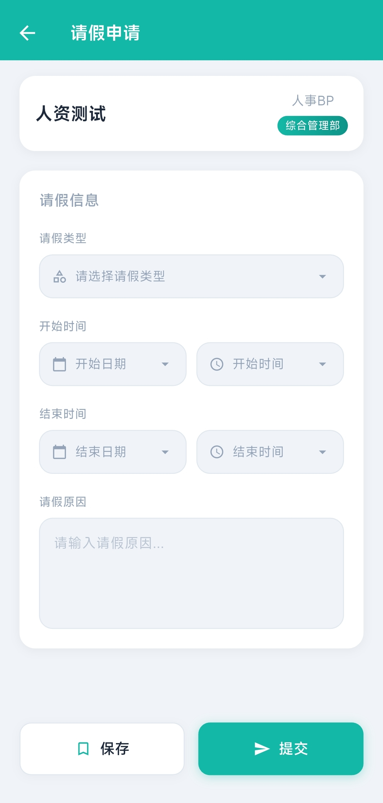
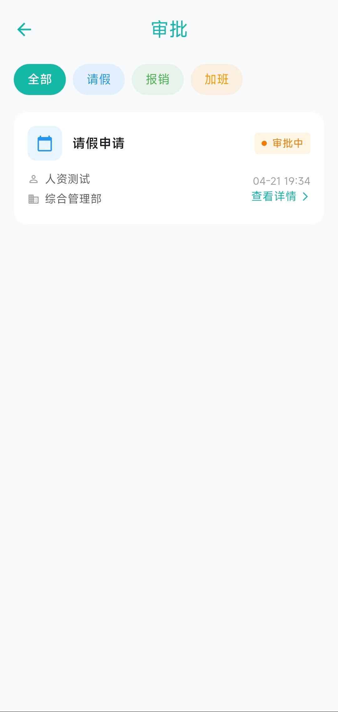
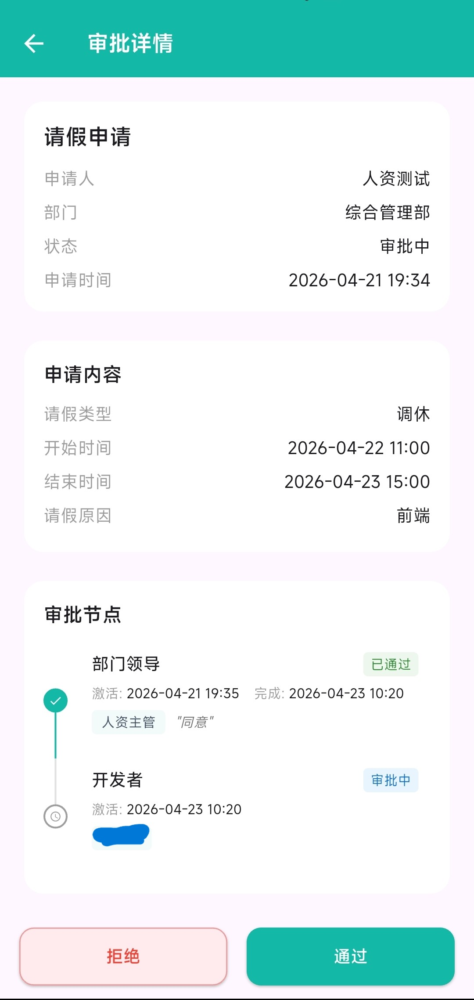

# DreamOA - Open Source Office System based on Flutter

> A lightweight(really?), cross-platform mobile OA (Office Automation) frontend solution. Platform support depends on Flutter capabilities.

🇨🇳 [简体中文](README.md) | 🇺🇸 English

[](https://opensource.org/licenses/MIT)
[](https://flutter.dev)


## Project Preview

<div align="center">
  
  
  
</div>

<div align="center">
  
  
  
</div>

<div align="center">
  
  
  
</div>

> ⚠️ The UI shown in the screenshots may not reflect the latest version. Actual interface is based on the project code.


## Related Projects

| Project | Repository | Description |
|---------|------------|-------------|
| **Frontend** | [dream-oa](https://github.com/DREAMDREAM66/dream-oa) | This project |
| **Backend** | [dream-oa-api](https://github.com/DREAMDREAM66/dream-oa-api) | .NET backend service |


## Core Features

The project is currently in its early stages. Implemented features include:

- **Authentication**: Username/Password login with automatic Token refresh.
- **Attendance**: Clock-in/out functionality with history display.
- **Approval Workflow**: Initiate leave/overtime applications, manage approvals, and view my applications.
- **Localization**: Multi-language support (Chinese/English).

*Planned Features: Global State Management, Custom Form Engine.*

## Tech Stack

- **Framework**: Flutter 3.35.5 (Dart 3.9.2)
- **State Management**: Built-in setState
- **Network**: Dio 5.9.2
- **Local Storage**: SharedPreferences
- **UI Components**: [Calendar: flutter_calendar_carousel](https://github.com/hyochan/flutter_calendar_carousel)

## Quick Start

### Prerequisites
**Developer Environment**
- Flutter SDK >= 3.35.5
- Dart SDK >= 3.9.2

### Installation & Running

1. **Clone the repository**
   ```bash
   git clone https://github.com/DREAMDREAM66/dream-oa.git
   cd dream-oa
   ```
2. **Install Dependencies**
   ```bash
   # Get packages
   flutter pub get
   # Check environment health
   flutter doctor
   ```
3. **Configuration**  
   Create a .env file in the root directory.  
   *This file contains sensitive info and is included in .gitignore, so it won't be committed.*
   ```
   # Enter your backend API address
   API_BASE_URL=https://your-api-domain.com/api
   ```
4. **Build & Run**
   ```
   flutter run
   # Or run on a specific device
   flutter run -d <device_id>
   ```

### Additional Configuration

1. **App Icon**  
   This project uses flutter_launcher_icons to generate icons. To customize:  
   - Place your source icon (oa_icon.png, recommended 1024x1024) in the assets/icons/ directory.
   - Run the following command in the project root:
   ```
   flutter pub run flutter_launcher_icons
   ```
2. **API Endpoints**  
   All API request definitions are located in utils/api_client.dart. You can modify them to match your backend:
   ``` dart
   final response = await dioClient.dio.get('/Common/current-time');
   ```

### iOS Development Configuration

After forking this project, you need to modify the following settings before building for iOS:

1. **Open the project with Xcode**
   ```bash
   open ios/Runner.xcworkspace
   ```

2. **Change Bundle Identifier**
   - Select the `Runner` project in the left sidebar
   - Go to the `Signing & Capabilities` tab
   - Change `com.xcql.dreamoa` to your unique identifier (e.g., `com.yourname.yourapp`)

3. **Select Developer Team**
   - In the same page, select your developer account from the `Team` dropdown menu

4. **Build & Run**
   ```bash
   flutter run
   ```

> 💡 **Note**: Android builds require no additional configuration. Just run `flutter build apk` directly.

## Contributing

**The author is a beginner in the open-source world. Contributions and suggestions from all angles are highly welcome!**

**We welcome Issues and Pull Requests!**
1. *Fork this repository*
2. *Create a Feat_xxx branch*
3. *Commit your changes*
4. *Open a Pull Request*

## License  

This project is licensed under the MIT License.  
In short: You are free to use, modify, and distribute this software for commercial or non-commercial purposes, provided you retain the original copyright notice.  

See the [LICENSE](LICENSE) file for details.